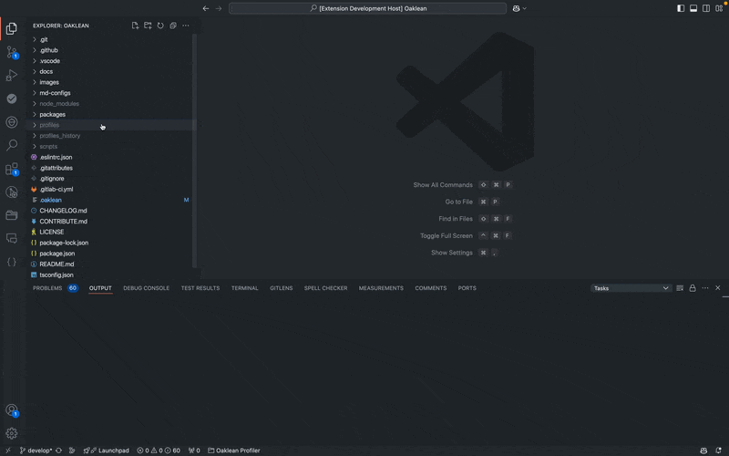

  

  
	

# Oaklean

Oaklean is a powerful Visual Studio Code extension designed to enhance your development workflow by providing insights into code optimization and resource usage in Node.js projects. This toolkit is specifically built to interpret reports generated from our [Oaklean Profiler](https://github.com/hitabisgmbh/oaklean), allowing you to identify areas of your codebase that can be optimized for improved performance and energy efficiency. Additionally, it offers a comprehensive overview of your project's Node.js dependencies and their resource consumption, enabling you to make informed decisions about optimizing your application's footprint.

## Table of Contents

- [Features](#features)
- [Requirements](#requirements)
- [Working with Oaklean](#working-with-oaklean)
- [For More Information](#for-more-information)
- [Contributing](#contributing)
	- [Contributing Guide](#contributing-guide)
- [Credits](#credits)
- [License](#license)

## Features

- **Profiler Report Interpretation:** Oaklean seamlessly integrates with our [Oaklean Profiler](https://github.com/hitabisgmbh/oaklean), enabling it to analyze and interpret generated reports. By leveraging this functionality, the toolkit identifies code segments that can be optimized for enhanced performance.
- **Code Highlighting for Optimization:** With its intelligent code highlighting capabilities, this extension visually identifies areas in your codebase that can be optimized. By pinpointing specific lines or blocks of code, the toolkit empowers you to make targeted improvements and streamline your application's execution.
- **Node.js Dependency Resource Overview:** Gain a comprehensive understanding of your project's dependencies and their resource usage. Oaklean provides an overview of resource consumption, allowing you to assess the impact of each dependency and optimize your project's overall efficiency.

> 📋 **Full Feature List:**
> [Here](./docs/README.md) you can find a detailed overview of the features.

## Requirements

To interpret profiler reports you need to generate them with our [Oaklean Profiler](https://github.com/hitabisgmbh/oaklean). As soon as you generated a report it will be listed under the available project reports with the "Select Project/Module Report" command.

## Working with Oaklean

1. Generate a profiler report using our [Oaklean Profiler](https://github.com/hitabisgmbh/oaklean) package.
2. Open the report file (`.oak`) in Visual Studio Code using the "Select Project/Module Report" command or simply by right clicking on a `.oak` file
3. The toolkit will automatically analyze and interpret the report, highlighting areas of code that can be optimized.
4. Use the provided overview on the left sidebar to assess resource usage of Node.js dependencies and make informed decisions for optimization.

## For More Information
### Website
* [Oaklean Website](https://www.oaklean.io/)

### Github Links
* [Oaklean Profiler](https://github.com/hitabisgmbh/oaklean)
* [Oaklean VS Code Extension](https://github.com/hitabisgmbh/oaklean-vscode)

### NPM Packages
* [Oaklean Packages](https://www.npmjs.com/search?q=%40oaklean)

### VS Code Extension
* [Oaklean Extension - Visual Studio Marketplace](https://marketplace.visualstudio.com/items?itemName=HitabisGmbH.oaklean)
* [Oaklean Extension - Open VSX Registry](https://open-vsx.org/extension/HitabisGmbH/oaklean)

## Contributing

### [Contributing Guide](CONTRIBUTING.md)

Check out our [contributing guide](./CONTRIBUTE.md) to understand our development workflow, learn how to suggest bug fixes and enhancements, and discover how to build and test your changes in Oaklean.

## Credits
This project exists thanks to all the people who [contribute](https://github.com/hitabisgmbh/oaklean-vscode/graphs/contributors)

## License
Oaklean is [MIT licensed](./LICENSE)