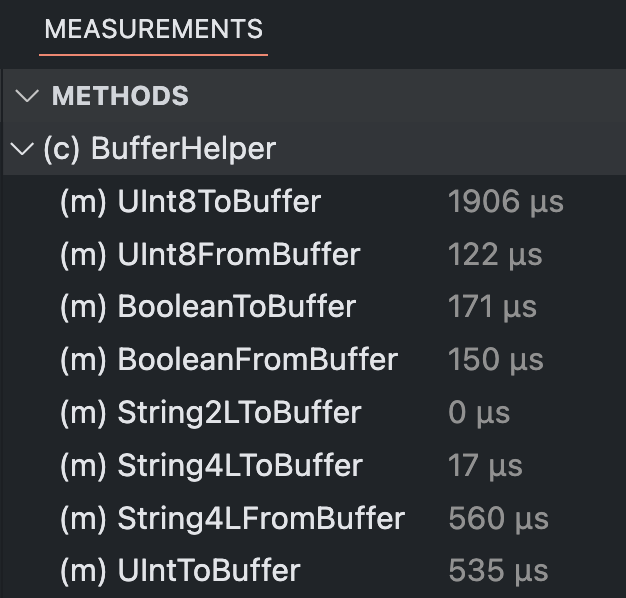

# File Method List of Opened File

In the lower panel under the "Measurements" tab, the "Methods" view displays the measured methods of the file opened in the editor. If there are no measured methods in the file, nothing is displayed.

The hierarchy is displayed regardless of the existence of measurement data. In the following example, SubClass has no measurement data, but is still displayed because there are methods with measurement data in the class. The levels can be closed or opened with a click on the arrow. Clicking on the name navigates to the corresponding place in the code.

In the bracket before the name, the type of the measured code location is displayed. The following abbreviations are used:

- class: (c)
- function: (f)
- functionExpression: (f)
- constructor: (f)
- method: (m)

