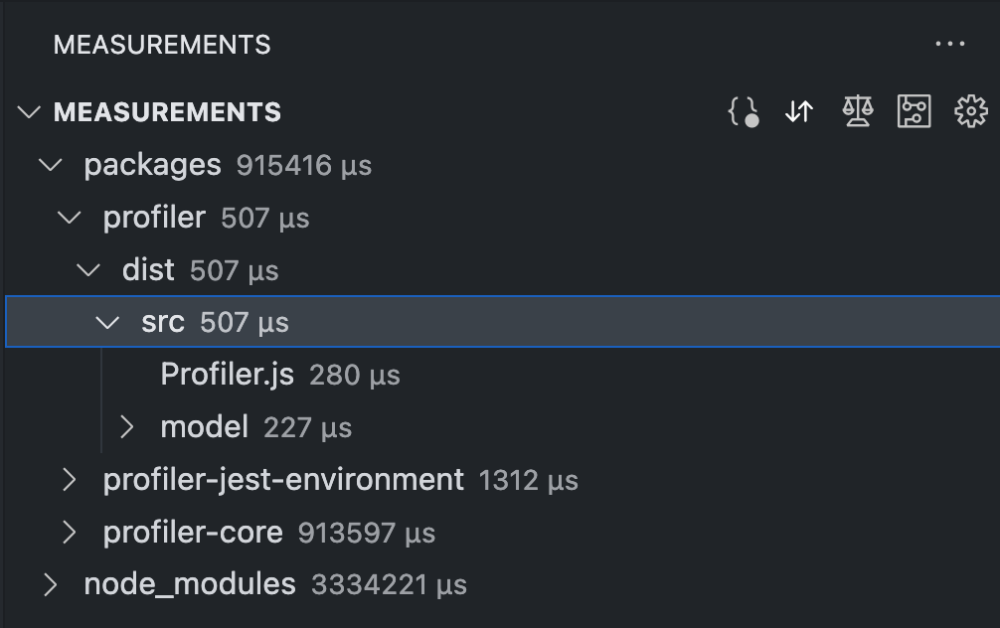

# File Tree

Upon selecting the extension, a tree structure is displayed under the "Measurements" section in the left panel. This tree structure mirrors the folder structure of the measurement data, displaying the sum of the measured functions next to each file and folder. Clicking on a file opens it in the editor.

The file tree can be [sorted](./Sort.md) and [filtered](./Filter.md) according to your preferences. Additionally, the [representation](./SelectValueRepresentation.md) and [sensor value type](./SelectSensorValue.md) of measurement data can be customized to suit your needs.