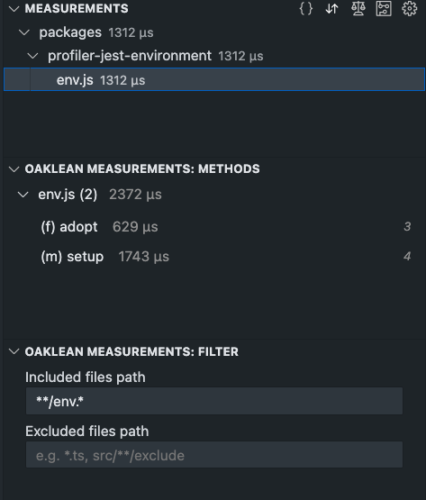

# Filter

The filter feature allows users to show and hide files and directories. The filters apply to both the [file tree](./FileTree.md) and [project method list](./ProjectMethodList.md) views. "Included files path" filters for the files or directories to be displayed, while "Excluded files path" hides them. Both filters can be used simultaneously.

Examples of possible filters:

- `**/env.js`: includes/excludes all files named `env.js` in all directories.
- `*/profiler-core/**/.js`: includes/excludes all `.js` files in the subdirectories of the `profiler-core` directory.
- `**/*.test.*`: includes/excludes the test files.

