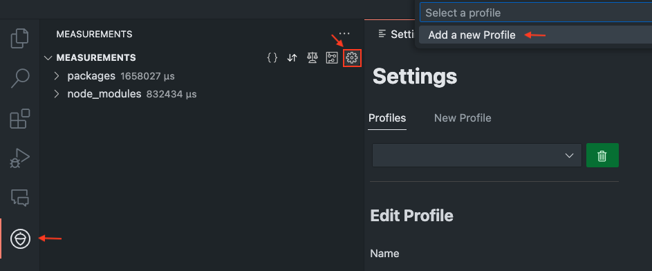
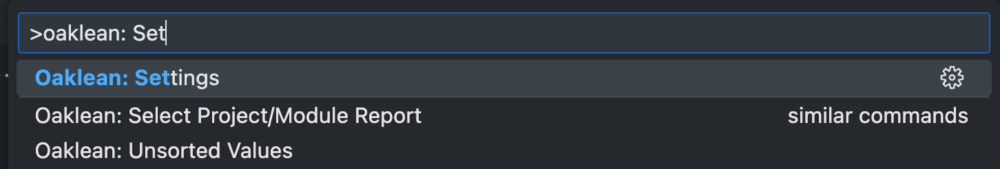
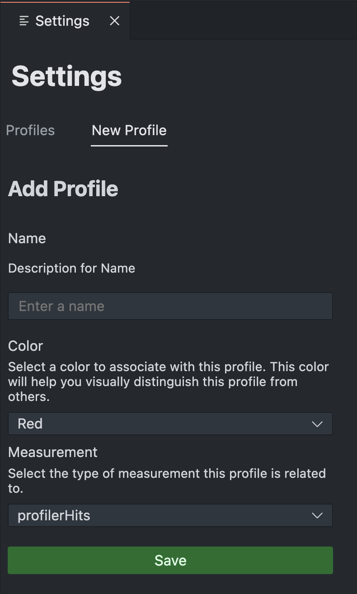
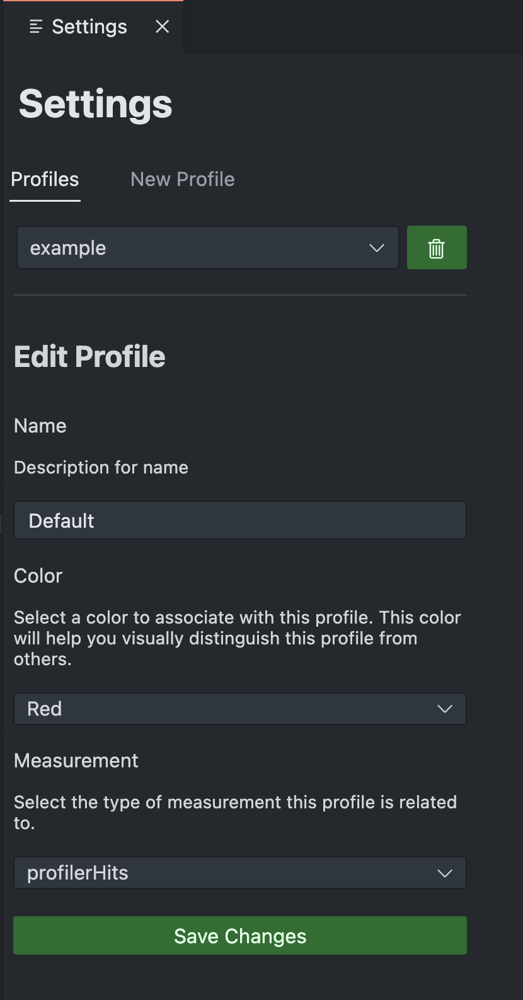
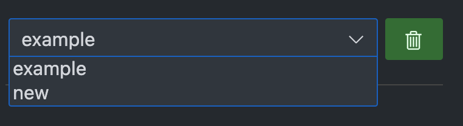
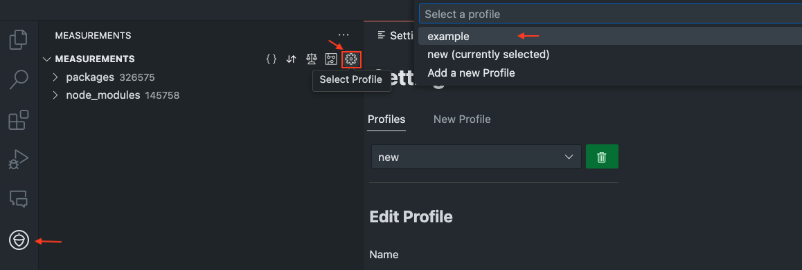
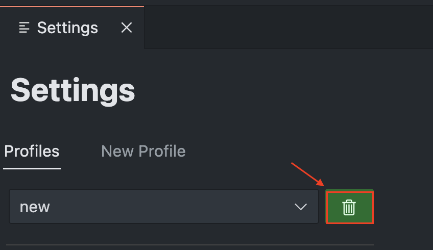

# Profile Management Settings Page

The profile management feature allows users to create, edit, and switch between different profiles. Each profile can be individually customized to focus on specific aspects of code analysis and optimization.

**Customizable Code Analysis:** By creating specific profiles, the code can be analyzed in different ways, depending on the selected metrics. This allows for precise addressing of performance issues and resource usage.

**Visualization of Optimization Areas:** Profiles can be configured with specific colors to visually highlight areas in the code that need optimization.

**Efficient Resource Management:** The ability to use different profiles for different test scenarios helps developers understand how different parts of the code consume resources.

**User-Friendliness and Productivity Increase:** The quick switching between predefined profiles makes it easier for developers to test and implement different optimization strategies without having to manually change settings. This saves time and increases productivity.

### Create a profile

1. Click on the settings icon in the measurement bar or use the command.

2. Navigate to the "Profiles" tab.
3. Click on "New Profile" to create a new profile.

4. Enter a name for the profile and add the desired properties.
5. Choose a color to visually distinguish this profile from others.
6. Select a measurement from the "Measurement" dropdown menu to determine which aspects of the code should be highlighted.

### Edit Profile

1. Select the profile to be edited from the dropdown menu under "Profiles".

2. Change the desired settings such as color or measurement.

3. Click on "Save Changes" to save the changes.

### Change Profile

1. Open the profile settings, as described above.

2. Select the profile to be activated from the dropdown menu.

**Or**

1. For a quick selection, go over the extension and choose the desired profile from there.

### Delete Profile

1. Select the desired profile from the dropdown menu.

2. Click the trash bin icon.

3. Confirm the deletion in the info message.