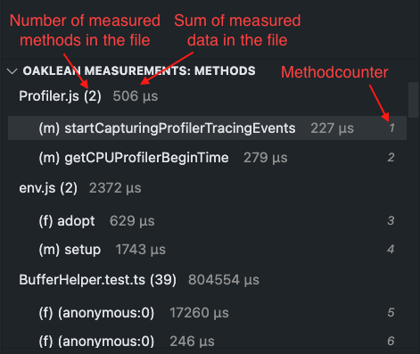

# Project-Wide Method List

The "Methods" section in the left panel displays all measured functions/methods in the files. The measurement value and the count of the method/function are displayed next to it. Clicking on the method opens the corresponding file in the editor and navigates to the relevant code.

In the bracket before the name, the type of the measured code location is displayed. The following abbreviations are used:

- class: (c)
- function: (f)
- functionExpression: (f)
- constructor: (f)
- method: (m)

The method list can be [sorted](./Sort.md) and [filtered](./Filter.md) according to your preferences. Additionally, the [representation](./SelectValueRepresentation.md) and [sensor value type](./SelectSensorValue.md) of measurement data can be customized to suit your needs.