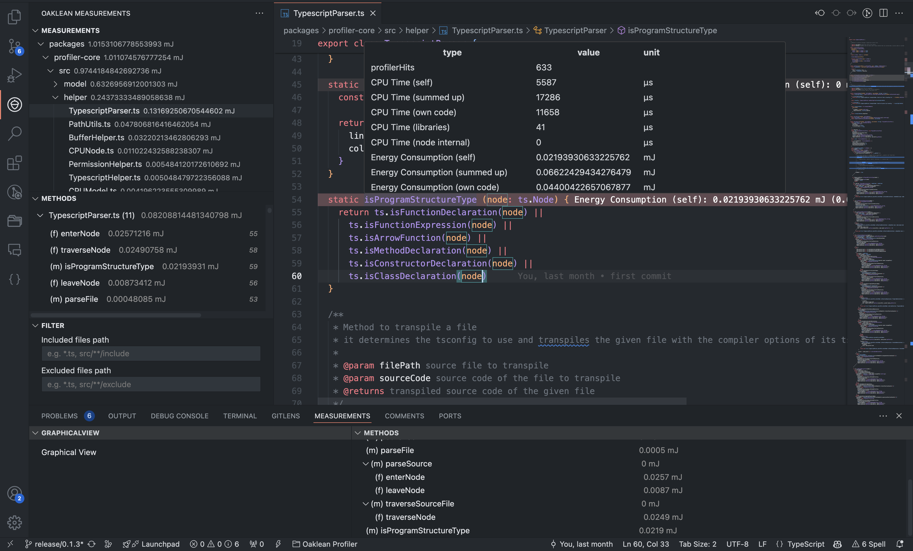

# Oaklean VSCode Extension Features

The Oaklean VSCode Extension is a powerful tool designed to visualize `*.oak` reports generated by the Oaklean profiler directly within the editor.

The following features are currently available:

- [File Tree](./FileTree.md)
- [Project-Wide Method List](./ProjectMethodList.md)
- [Filter](./Filter.md)
- [Sort](./Sort.md)
- [Select Value Representation](./SelectValueRepresentation.md)
- [Select Sensor Value](./SelectSensorValue.md)
- [File Method List of Opened File](./FileMethodList.md)
- [How to interpret Measurements](./SensorValues.md)
- [Profile Management Settings](./ProfileManagementSettings.md)
- [Report Preview](./ReportPreview.md)