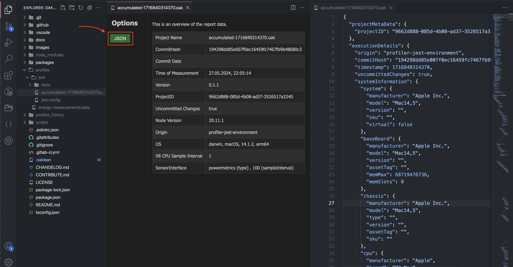

# Report Preview

1. Open a .oak file, which was created by the measurement tool, in VS Code, then a window appears.

2. This view presents the .oak files in a structured format that makes it easier to understand and analyze certain details like project name, commit hash, node version, and other relevant metrics.

## Usage

Simply open a .oak file, which was created by the measurement tool, in VS Code, then a window appears (as shown above).

## JSON View

### Access to the JSON View

1. Within the webview, which automatically opens for .oak files, a structured overview of the JSON data is displayed.

2. To access the raw JSON data, you can click on the "JSON" button.

