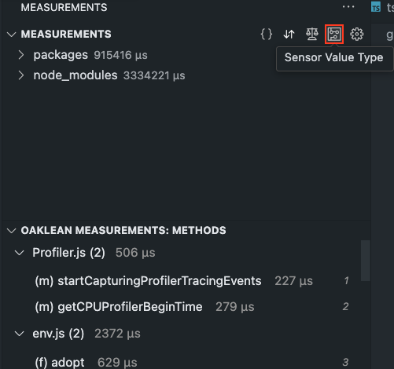
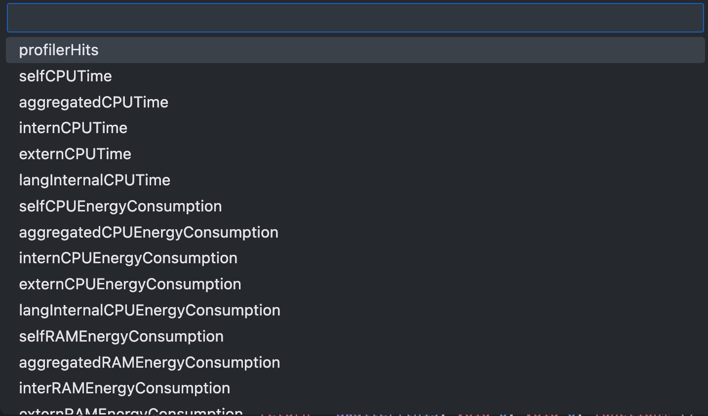
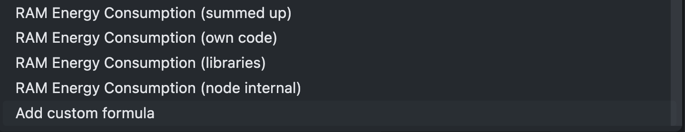
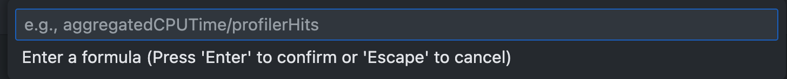

# Select Sensor Value 

The red-framed button in the picture allows users to select the measurement data to be displayed. Selecting a type changes the display of the measurement values in the left panel under [file tree](./FileTree.md) view and [project method list](./ProjectMethodList.md) view as well as in the lower panel in the [file method list](./FileMethodList.md).

At the end of the list, "Add custom formula" can be selected. Users can create a custom representation of the measurement data with a mathematically valid formula. The formula may only contain mathematical symbols, names of the measurement data, and numbers. If the formula is incorrect, the previously selected value is retained.

