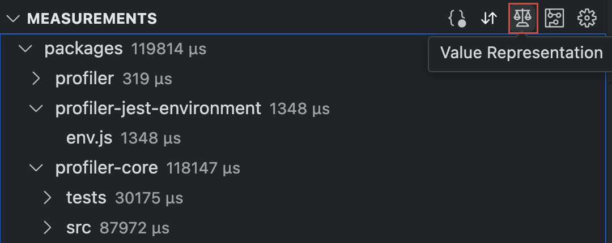
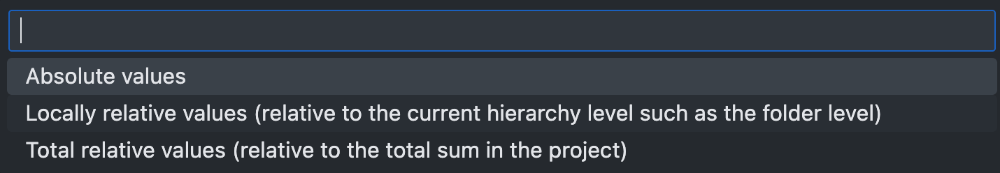
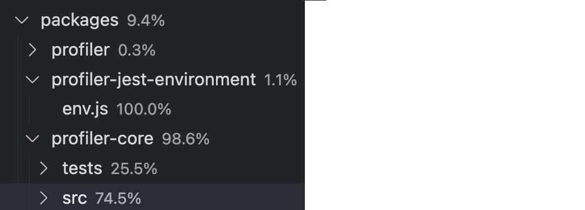
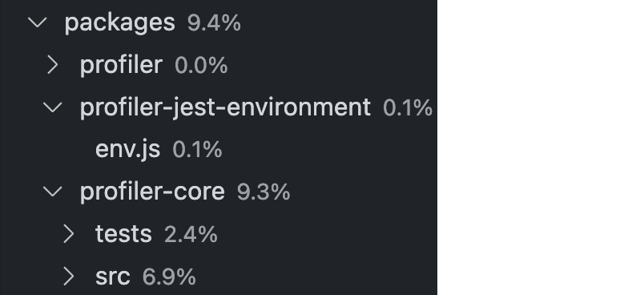

# Select Value Representation

The **Value Representation** feature allows users to choose the display type of the measurement data in the [file tree](./FileTree.md) view located in the left panel. 

- **Absolute Values** displays the pure measurement data of the report, along with their units. For directories, it sums the measurement data of all files within them.

	

	

- **Locally relative values** represent the measurement data relative to the hierarchical level (per directory or node module). Thus, the values at a given level must add up to 100%.

	

- **Total Relative Values** represent a level in the tree relative to the entire project. Thus, the relative values of all levels together add up to 100%.

	
