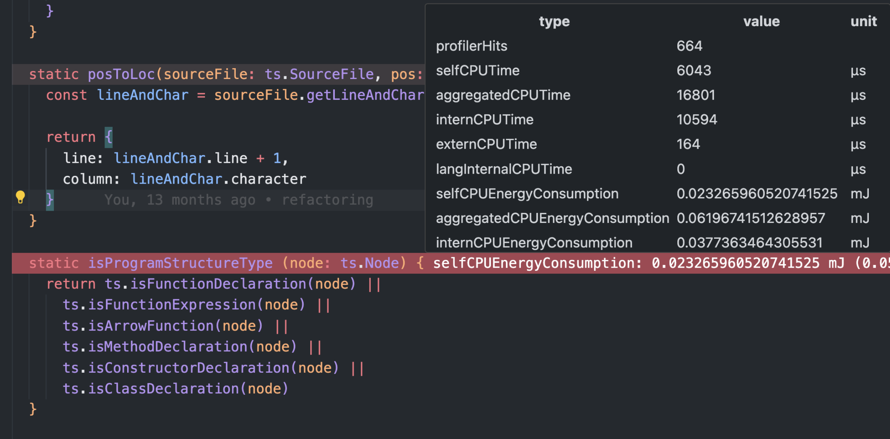

# How to interpret Measurements

The Oaklean VS Code Extension provides insights into the resource consumption of your NodeJS/TypeScript application. In the following sections, we will explain how to interpret the measurements related to resource consumption.

> ⚠️ We use "Sensor Values" and "Measurements" synonymously.

# Execution Scopes
To better understand where high resource usage originates, we categorize the measurements as follows:
- **own code:** Code of the project being measured.
- **libraries:** Code of a Node module that is imported and used in the project being measured.
- **node internal:** Code of the programming language itself or standard libraries integrated into the Node runtime environment.

# Sensor Value Types

To interpret sensor values, we should look at their naming conventions. Except for the value **profilerHits**, each sensor value follows this naming convention:
`<type-of-resource> (<category>)`

> **profilerHits**: In addition to resource consumption values, there is a measurement value called **profilerHits**. This does not describe a resource used by the application but rather how often the CPU profiler, used to measure CPU time, detected a certain source code location.

### Categories
There are currently five categories:
- **self:** Indicates how much resource consumption originates from the source code location **itself**.
- **own code:** Indicates how much resource consumption originates from the invocation of functions of **your code**.
- **libraries:** Indicates how much resource consumption originates from the invocation of **library** functions.
- **node internal:** Indicates how much resource consumption originates from the invocation of **node internal** functions.
- **summed up:** Includes all the above categories.

### Types of Resources

Currently, three types of resources are measured:
- **CPU Time**
- **CPU Energy Consumption**
- **RAM Energy Consumption**

### Example
Sensor values are stored at specific source code locations. In the example below, we interpret the sensor values of the method `isProgramStructureType`.

Given the example above, the measurements describe the following:

| Sensor Value Type                | Description |
|----------------------------------|-------------|
| CPU Energy Consumption (**self**)         | How much CPU energy was consumed by the method `isProgramStructureType` **itself**.            |
| CPUEnergyConsumption (**own code**)       | How much CPU energy was consumed by methods **of your code** that were directly or indirectly called by the method `isProgramStructureType`.            |
| CPU Energy Consumption (**libraries**)       | How much CPU energy was consumed by **library** methods that were directly or indirectly called by the method `isProgramStructureType`.            |
| CPUEnergyConsumption (**node internal**) | How much CPU energy was consumed by **node internal** methods that were directly or indirectly called by the method `isProgramStructureType`.            |
| CPU Energy Consumption (**summed up**)   | How much CPU energy was consumed in total; this is the sum of all the values above.            |

# Custom Formula
Users can create a custom representation of the measurement data with a mathematically valid formula. The formula may only contain mathematical symbols, names of the measurement data, and numbers.

Below is a list of all available variable names of the measurement data. The naming convention is:
`<prefix><type-of-resource>`

## Prefixes
Prefixes are directly correspondent to the [categories](#categories) listed above
- self = **self**
- intern = **own code**
- extern = **libraries**
- langInternal = **node internal**
- aggregated = **summed up**

## All available variable names of the measurement data are:
| Variable Name                		| Unit  |
|---------------------------------|-------|
| profilerHits										| 			|
| selfCPUTime											| µs		|
| aggregatedCPUTime								| µs		|
| internCPUTime										| µs		|
| externCPUTime										| µs		|
| langInternalCPUTime							| µs		|
| selfCPUEnergyConsumption				| mJ		|
| aggregatedCPUEnergyConsumption	| mJ		|
| internCPUEnergyConsumption			| mJ		|
| externCPUEnergyConsumption			| mJ		|
| langInternalCPUEnergyConsumption| mJ		|
| selfRAMEnergyConsumption				| mJ		|
| aggregatedRAMEnergyConsumption	| mJ		|
| internRAMEnergyConsumption			| mJ		|
| externRAMEnergyConsumption			| mJ		|
| langInternalRAMEnergyConsumption| mJ		|

### Example Formulas
- A formula to establish the relationship between CPU energy consumption and CPU time: `selfCPUEnergyConsumption/selfCPUTime`
- A formula to detect the functions/methods with the highest proportionate library energy consumption: `externCPUEnergyConsumption/aggregatedCPUEnergyConsumption`
