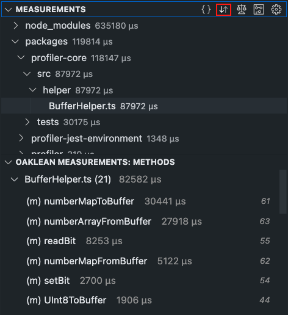

# Sort 

The "Sort" button sorts the measurement values in ascending and descending order. The entire tree of the [file tree](./FileTree.md) view is sorted. In the [project method list](./ProjectMethodList.md) view, the files are sorted, and the methods within each file are also sorted.

